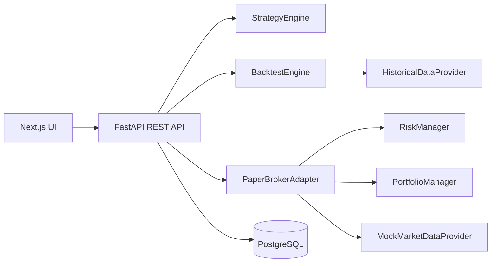
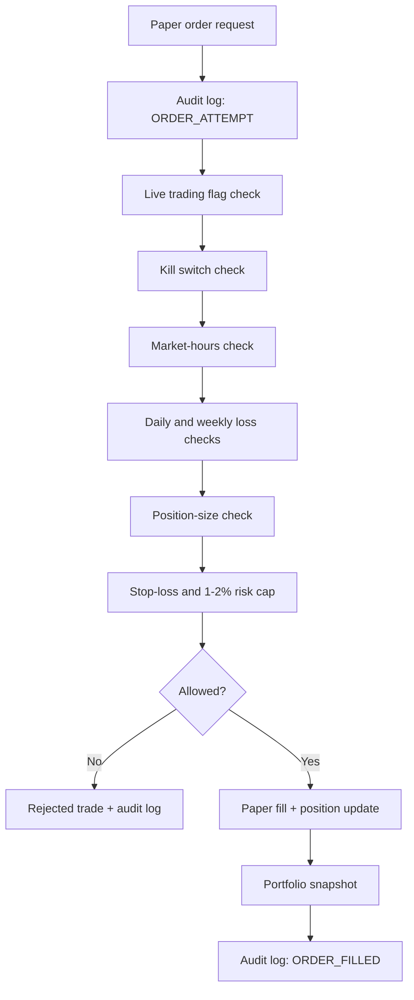

# AutoTrade OS Architecture

## Boundary Model

AutoTrade OS separates market data, strategy logic, risk checks, portfolio state, and broker execution behind explicit interfaces:

- `MarketDataProvider`
- `BrokerAdapter`
- `StrategyEngine`
- `RiskManager`
- `PortfolioManager`

The first implemented broker is `PaperBrokerAdapter`. `InteractiveBrokersAdapter` is a guarded stub and does not execute live orders.

## Request Flow

## Safety Flow

## Data Model

- `User`: local personal user record.
- `Strategy`: saved rule set and symbol.
- `Backtest`: metrics, trade list, and equity curve.
- `Trade`: filled or rejected paper order audit record.
- `Position`: current simulated holdings.
- `PortfolioSnapshot`: cash, value, daily P/L, total return.
- `RiskSettings`: hard pre-trade controls.
- `SystemLog`: audit trail for orders, risk changes, paper sessions, and boot events.

## Market Data

Backtests use `HistoricalDataProvider`, which attempts Yahoo Finance through `yfinance` and falls back to deterministic mock candles if external data is unavailable.

Paper trading uses `MockMarketDataProvider` by default to avoid runtime dependency on a paid or unstable provider.

## Live Trading

`ENABLE_LIVE_TRADING=false` is the default and must remain the safe baseline. The current Interactive Brokers adapter is intentionally non-executing. Any future live adapter should add:

- Manual account connection setup.
- Secrets vault or platform secret storage.
- Broker-side order reconciliation.
- Idempotency keys for order submission.
- Explicit manual confirmation gates.
- Separate production database and audit retention.
- Read-only mode before live order mode.

